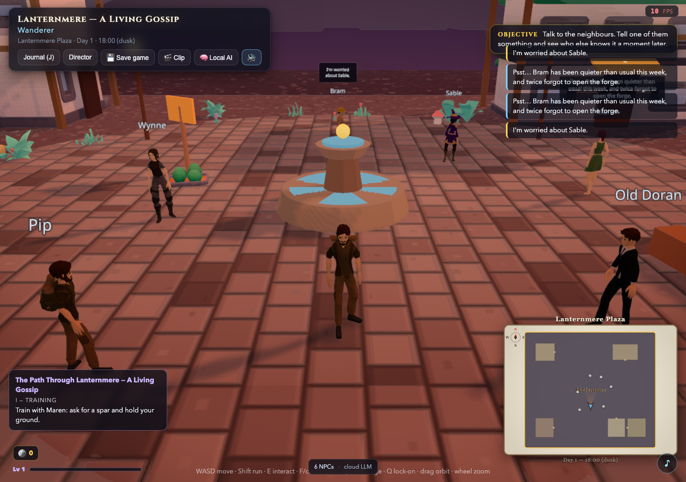
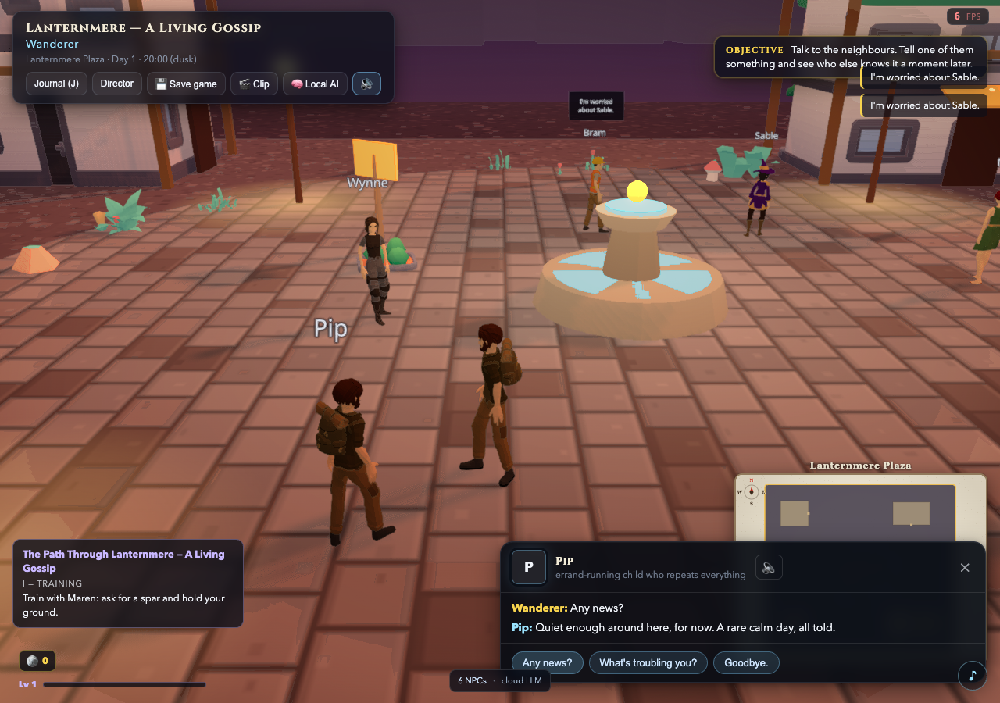

# Setup clock and local memory qualification

The game advanced autonomous time before the player finished choosing a world
and character. The client now holds the simulation during setup and starts it
when the player enters play. The Rival tutorial's existing hold remains intact.

This repairs a concrete path to pressure accumulating before a first
conversation. It does not establish a fun game, fix all pacing problems, or
qualify the currently deployed Worker.

## Reproduction and change

The audit started from clean `5f9390a05a09d0fd1ce2c49f2272518adcbb7425`.
Existing dependencies were restored using `pnpm install --frozen-lockfile`; the
lockfile and dependency versions did not change.

Before the repair, `useWorldStore.init()` started the agent loop immediately
after loading state. This happened underneath the title and character screens.
The server was exercised in its existing scripted mode with original bundled
fictional worlds and an isolated local save directory.

| Observed phase | Before the change | After the change |
| --- | --- | --- |
| Initial title | Loop running, 08:00, pressure 18 | Loop idle, 08:00, pressure 18 |
| Waiting on title | After 10 seconds: 08:30, pressure 22 | After 9 seconds: still 08:00, pressure 18 |
| Character setup | A further 5 seconds: 08:45, pressure 24 | Lanternmere after 9 seconds: still 18:00, pressure 0 |
| Entering play | Already running | Starts normally; Lanternmere reached 18:30, pressure 4 |

The world store now synchronizes loop state against the actual game phase.
The app repeats that synchronization when the phase changes, including entry
from a restored save. World initialization still reconciles an already-running
session, stopping it if the player is in setup. No server simulation rules,
pressure thresholds, or world content were changed.

Focused regression coverage checks title and character holds, the transition
into play, avoiding redundant start calls, and preserving the Rival tutorial
hold. The production Vite build was also served locally: title and character
screens stayed at tick 0 for five seconds each; entry into play reached tick 2.
This behavior was verified beyond the development module loader.

## Scripted talk, memory, save, restore

The local Lanternmere session used existing UI actions:

1. Selected the Lanternmere showcase and began as the Wanderer.
2. Rendered the town and all six NPCs. The scene and dialogue screenshots were
   inspected directly.
3. Used keyboard movement toward Pip, reducing the observed distance from about
   3.77 to 1.82 world units, then interacted with E. No position or world-state
   injection was used.
4. Chose **Any news?** in the existing scripted dialogue UI. Pip replied:
   “Quiet enough around here, for now. A rare calm day, all told.”
5. Verified authoritative NPC state gained `A visitor asked me for news.` at
   tick 8. That memory was absent before the conversation.
6. Clicked **Save game**, observed **Saved**, reloaded the page, and selected
   the actual browser save. The restored world still contained the same Pip
   memory at tick 8. The restored world snapshot was at tick 9.

The completed browser run had no page errors. The UI route was not mocked; the
simulation API, choice handler, NPC memories, OPFS save, and restore operation
all ran locally.

[Structured receipt](./evidence/setup-2026-09-07/receipt.json) retains the
before/after measurements, built-client check, movement observations, dialogue,
and memory comparison. Detailed synthetic request/state evidence remains local
under `tmp/shareability-2026-09-07/`.

## Limits of the proof

- This is **scripted conversation and saved state**, not freeform model-backed
  dialogue, semantic recall, relationship quality, or autonomous long-term
  memory qualification. An initial harness attempt expecting a freeform input
  correctly found story choices instead; the qualification followed those
  actual supported choices.
- AI/provider settings were disabled for the local server without reading env
  files. Browser model and analytics requests were blocked. No model was
  downloaded, no private media/data used, and no paid provider called.
- Blocking every external request initially blocked the existing Unicode font
  resolver and left the scene suspended. Allowing the existing public font
  sources rendered the town without page errors. The qualified run allowed
  localhost, jsDelivr, Google Fonts CSS and fonts; it did not qualify a fully
  offline scene.
- Headless SwiftShader ran roughly 6–11 FPS during the inspected scene. This is
  geometry/interaction evidence, not a hardware GPU performance verdict.
- Ambient cutscenes still interrupted movement, and the HUD says “cloud LLM”
  even in this scripted session. Those presentation and pacing gaps remain;
  the label is not proof of model execution.
- A local OPFS restoration does not qualify the deployed Worker route. The
  documented Worker/local-server parity gap remains, including `/api/load`.
  No production configuration, Worker, marketing site, or deployment changed.

## Validation and retained work

`pnpm verify:readiness` passed: typecheck, Biome, **474 tests across 64 files**,
and the production 3D build. The focused world-store/Rival checks passed 16
tests. Existing informational lint notices and large bundle warnings remain.
The docs validator and `git diff --check` passed.

Task reconciliation found **0 open GitHub issues, 0 open PRs, 0 closures**.
The old documentation-consolidation entry was stale and is now marked complete;
the documentation tree and links validate. No gameplay or publication gate was
closed on the strength of a local screenshot or scripted response.

AliveVille remains inactive. Its first product gate is still a human Rival
fun/not-fun verdict and understandable pacing. A future sharing claim also
requires an authorized deployment and live verification, Worker parity,
model-backed conversation/recall checks, real-device GPU/voice evidence, and
review of automatic model preloads and font resilience. The deferred north-star,
vendor/shop, and interior ideas remain behind those gates.
